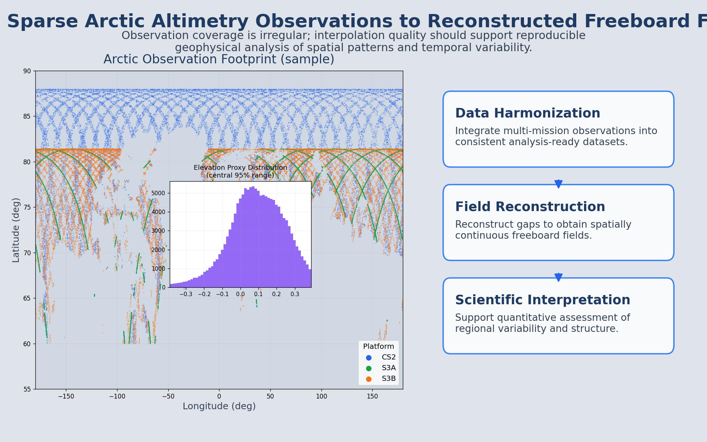
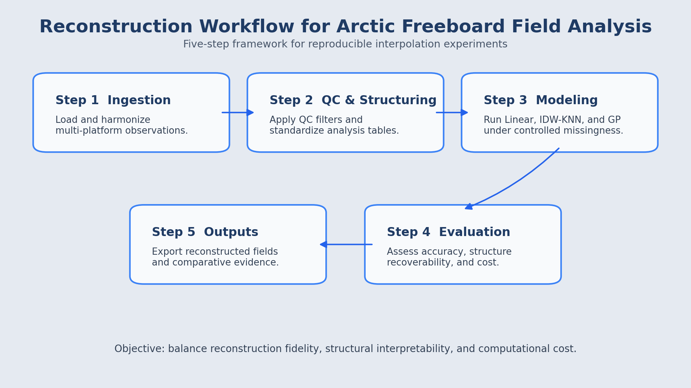
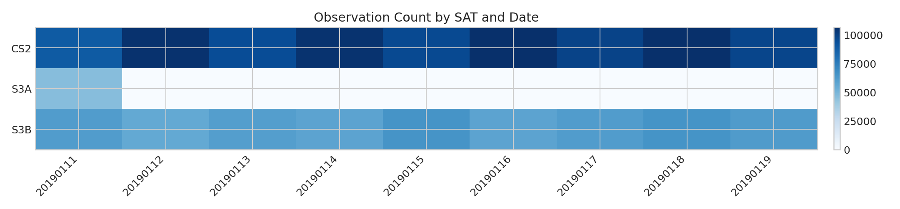
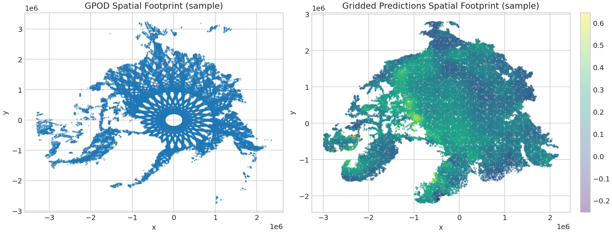
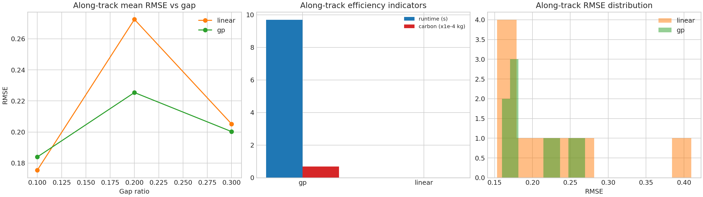
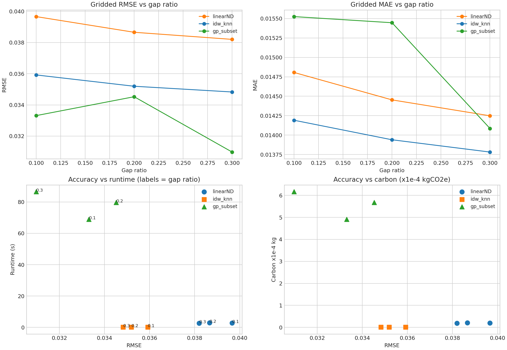
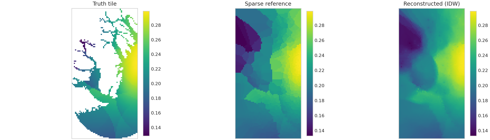
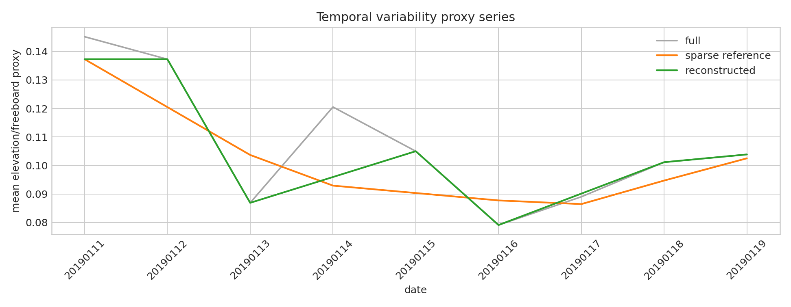

# Arctic Sea-Ice Freeboard Reconstruction with Multi-Method Interpolation

## Table of Contents
- [Project Overview](#project-overview)
- [Code Tutorial and Walkthrough](#code-tutorial-and-walkthrough)
- [Background and Motivation](#background-and-motivation)
- [Problem Statement](#problem-statement)
- [Data Provenance](#data-provenance)
- [Methodology](#methodology)
  - [Experiment Design](#experiment-design)
  - [Interpolation Methods](#interpolation-methods)
  - [Recoverability Analysis](#recoverability-analysis)
- [Results and Performance](#results-and-performance)
- [Environmental Impact Assessment](#environmental-impact-assessment)
- [Discussion](#discussion)
- [Limitations and Future Work](#limitations-and-future-work)
- [Reproducibility and Execution](#reproducibility-and-execution)
- [Repository Structure](#repository-structure)
- [References](#references)

## Project Overview

This project evaluates interpolation strategies for reconstructing sparse Arctic sea-ice freeboard observations from processed satellite-altimetry datasets. The work is structured as a full research deliverable: data provenance, controlled experiments, quantitative comparison, structural recoverability diagnostics, environmental accounting, and reproducible artifacts.

Two reconstruction settings are studied:

- **Trajectory-wise reconstruction** on along-track observations.
- **Spatial-field reconstruction** on irregularly sampled gridded surfaces.

The central objective is not only to minimize prediction error, but also to identify methods that preserve physically meaningful structure at practical computational cost.

## Code Tutorial and Walkthrough

For a comprehensive walkthrough of the code implementation and methodology, watch the detailed project walkthrough video:

This walkthrough provides step-by-step explanations of the interpolation pipeline, experiment design, recoverability analysis, and environmental trade-off evaluation used in this project.

*Figure 1. Research background context from Arctic satellite-altimetry observation systems to analysis-ready datasets and reconstruction use cases.*

*Figure 2. Reconstruction workflow from observation ingestion to analysis-ready outputs (five-step process).*

## Background and Motivation

Sea-ice freeboard observations are sparse in both space and time due to coverage constraints, retrieval limitations, and quality-control filtering. Interpolation is therefore unavoidable in most scientific analysis pipelines.

However, a low RMSE alone is insufficient for Earth-observation applications. A useful method should also:

- preserve mesoscale spatial signatures,
- retain short-timescale temporal variability,
- provide an acceptable runtime/carbon profile for repeated experimental evaluation workflows.

This project explicitly evaluates all three aspects.

## Problem Statement

The analysis addresses four questions:

1. How do linear and Gaussian-process methods compare for trajectory-wise reconstruction under increasing data loss?
2. How do LinearND, inverse-distance weighting, and Gaussian-process subset modeling compare for spatial-field reconstruction?
3. Does interpolation improve recoverability of unresolved spatial and temporal structure relative to sparse-reference inputs?
4. What are the accuracy-runtime-carbon trade-offs of these methods?

## Data Provenance

### Raw-data origin

The processed analysis tables used here originate from Arctic satellite altimetry observations from:

- Sentinel-3A / Sentinel-3B (SRAL)
- CryoSat-2

### Analysis-ready files used in this repository

- `data/df_GPOD.csv`
  - point observations with coordinates, date/platform, class labels, and elevation/freeboard proxy values.
- `data/gridded_freeboard_arctic.h5`
  - gridded prediction table used for spatial reconstruction and recoverability diagnostics.
- `data/GPSat_alongtrack_Freeboard.h5`
  - along-track dataset retained for traceability.

### Processing boundary

**Upstream preprocessing (already completed):**

- coordinate/time harmonization,
- schema standardization across platforms,
- quality-control filtering,
- export into structured CSV/HDF analysis tables.

**Notebook-side processing (this project):**

- experiment-specific column selection,
- key-null filtering for model compatibility,
- reproducible masking and split generation for missing-data stress tests.

*Figure 3. Observation coverage by platform and date after upstream processing.*

*Figure 4. Spatial footprint of observation points and gridded datasets used in experiments.*

## Methodology

The analysis workflow (captured in `notebooks/final_project.executed.ipynb`) follows a five-stage pipeline:

1. Data loading, schema audit, and exploratory diagnostics.
2. Trajectory-wise interpolation experiments.
3. Spatial-field interpolation experiments.
4. Spatial and temporal recoverability analysis.
5. Runtime-energy-carbon aggregation and trade-off reporting.

### Experiment Design

Trajectory-wise experiments:

- methods: Linear, Gaussian Process
- missing ratios: 0.1 / 0.2 / 0.3
- data slices: top observation-dense tracks

Spatial-field experiments:

- methods: LinearND, IDW-KNN, GP-subset
- missing ratios: 0.1 / 0.2 / 0.3
- GP is subset-capped to maintain practical runtime

### Interpolation Methods

- **Linear / LinearND:** fast deterministic interpolation, low computational overhead.
- **IDW-KNN:** distance-weighted local interpolation on irregular 2D geometry.
- **Gaussian Process:** probabilistic interpolation with uncertainty-aware behavior, but substantially higher compute cost.

### Recoverability Analysis

To go beyond pointwise error, recoverability metrics are computed against denser references.

Spatial recoverability metrics:

- feature-count behavior,
- edge sharpness,
- mesoscale spectral-band power.

Temporal recoverability metrics:

- variance,
- lag-1 autocorrelation,
- frequency-band power.

## Results and Performance

### Headline outcomes

From `outputs/metrics/summary_metrics.json`:

- Best trajectory-wise RMSE: **0.1534**
- Best spatial-field RMSE: **0.0310**
- Total estimated carbon across recorded runs: **0.00236 kgCO2e**

### Method comparison (aggregated)

Trajectory-wise (mean over tested configurations):

| Method | Mean RMSE | Mean MAE | Mean Runtime (s) | Mean Carbon (kgCO2e) |
|---|---:|---:|---:|---:|
| Linear | 0.2177 | 0.1159 | 0.00004 | 2.84e-10 |
| GP | 0.2032 | 0.1300 | 9.6953 | 6.91e-05 |

Spatial-field (mean over tested configurations):

| Method | Mean RMSE | Mean MAE | Mean Runtime (s) | Mean Carbon (kgCO2e) |
|---|---:|---:|---:|---:|
| LinearND | 0.0388 | 0.0145 | 2.7554 | 1.96e-05 |
| IDW-KNN | 0.0353 | 0.0140 | 0.1368 | 9.74e-07 |
| GP-subset | 0.0329 | 0.0150 | 78.4218 | 5.59e-04 |

### Structural recoverability findings

Spatial recoverability gains:

- Feature recovery gain: **1.11**
- Edge recovery gain: **10.95**
- Spectral-band recovery gain: **2.28**

Temporal recoverability gains:

- Variance recovery gain: **2.52**
- Lag-1 recovery gain: **7.13**
- Band-power recovery gain: **3.00**

Interpretation:

- Interpolation improves structural fidelity relative to sparse-reference inputs.
- IDW-KNN is a strong efficiency-performance compromise for spatial reconstruction.
- GP provides the strongest error performance in tested spatial settings but at substantially higher computational cost.

*Figure 5. Trajectory-wise error and efficiency comparison across interpolation methods.*

*Figure 6. Spatial-field method comparison under varying missing-data ratios.*

*Figure 7. Spatial recoverability comparison between sparse reference and reconstructed field.*

*Figure 8. Temporal recoverability in regional freeboard variability proxy series.*

## Environmental Impact Assessment

Per-run carbon estimates are computed using explicit assumptions:

- average compute power: 45W
- PUE: 1.2
- carbon intensity: 475 gCO2/kWh

Trade-off artifacts are exported to:

- `outputs/figures/accuracy_runtime_carbon_tradeoff.png`
- `outputs/tables/environment_scenario_comparison.csv`

These outputs provide quantitative evidence for balancing reconstruction quality and resource use.

## Discussion

Key methodological conclusions:

- **Trajectory-wise setting:** GP improves RMSE but may be hard to justify for high-throughput runs unless uncertainty estimation is required.
- **Spatial-field setting:** GP-subset gives the best mean RMSE; IDW-KNN offers near-competitive error with dramatically lower runtime/carbon.
- **Feature diagnostics:** recoverability gains indicate that interpolation is not only smoothing values but restoring meaningful structure.

## Limitations and Future Work

Current limitations:

- spatial reference field is based on processed prediction datasets rather than fully independent raw-truth maps,
- GP in 2D is subset-capped for runtime feasibility,
- temporal recoverability uses regional proxy series rather than full assimilation-grade diagnostics.

Future work priorities:

1. Add spatial block cross-validation for stricter generalization tests.
2. Integrate external reference datasets for stronger absolute validation.
3. Extend recoverability with additional physics-informed descriptors (anisotropy/coherence-scale diagnostics).
4. Evaluate scalable probabilistic alternatives (e.g., sparse GP variants) for lower-cost uncertainty-aware analysis.

## Reproducibility and Execution

Environment definitions:

- `requirements.txt`
- `environment.yml`

Notebook artifact:

- `notebooks/final_project.executed.ipynb`

Run steps:

1. Create environment from `requirements.txt` or `environment.yml`.
2. Open and review `notebooks/final_project.executed.ipynb` (executed, with outputs embedded).
3. Review generated artifacts under `outputs/`.

## Repository Structure

- `data/` — input analysis tables
- `notebooks/` — analysis notebook and executed artifact
- `outputs/figures/` — all generated plots
- `outputs/tables/` — provenance/schema/trade-off tables
- `outputs/metrics/` — experiment metrics and summary JSON
- `requirements.txt`, `environment.yml` — reproducible environment specs

## References

1. Wingham, D. J., et al. (2006). CryoSat: A mission to determine the fluctuations in Earth’s land and marine ice fields. *Advances in Space Research*.
2. Quartly, G. D., et al. (2019). A review of progress in satellite altimetry for coastal and inland waters. *Remote Sensing*.
3. Kurtz, N. T., et al. (2014). Sea ice thickness, freeboard, and snow depth products from Operation IceBridge airborne data. *The Cryosphere*.
4. Rasmussen, C. E., & Williams, C. K. I. (2006). *Gaussian Processes for Machine Learning*. MIT Press.
5. Shepard, D. (1968). A two-dimensional interpolation function for irregularly-spaced data. *Proceedings of the ACM National Conference*.
